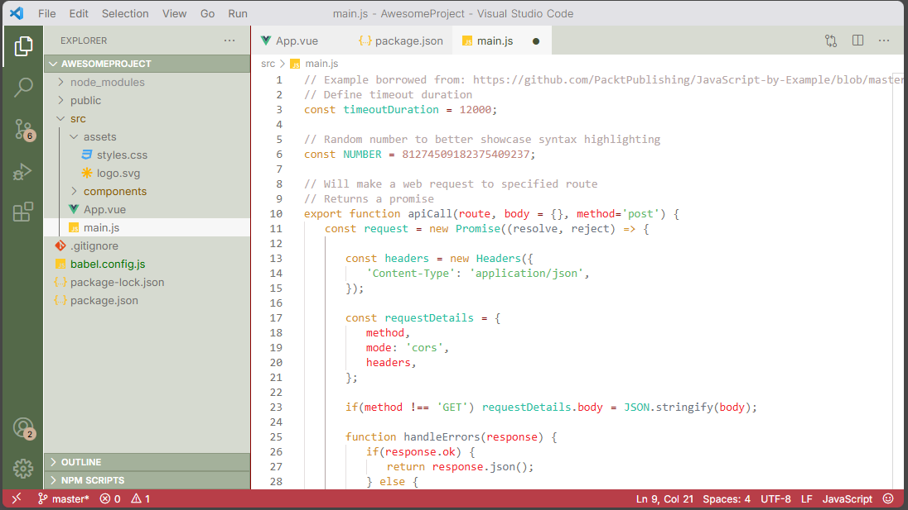

# 🎄White Christmas❄️
*Visual Studio Code Color Theme*
The theme supports version 1.60.0 or newer.

A festive, cozy light theme designed to bring the holiday cheer to your code editor! Like a field of freshly fallen snow with the iconic green and red colors of the season.

Compatible with Jupyter Notebooks.

## Installation
**Search in VS Code**: Open Extensions (`Ctrl+Shift+X` or `Cmd+Shift+X`), search for "*White Christmas Theme*" and click **Install**.

**Activate**: Go to **File** > **Preferences** > **Theme** > **Color Theme** (or **Code** > **Preferences** on macOS) and select *White Christmas Theme*.

## Contributing
Recolored icon is from [Flaticon](https://www.flaticon.com/free-icons/christmas).

